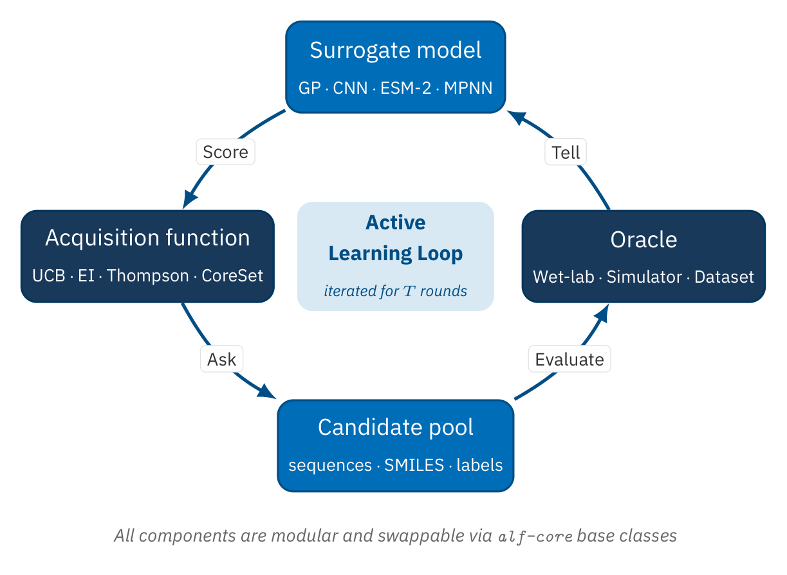

# ALF (Active Learning Framework)

[](https://github.com/astral-sh/uv)
[](https://www.python.org/downloads/)
[](LICENSE)
[](https://instadeepai.github.io/alf/)
[](https://github.com/instadeepai/alf/tree/main/core)
[](https://github.com/instadeepai/alf/tree/main/tools)
[](https://github.com/pre-commit/pre-commit)
[](https://github.com/instadeepai/alf/actions/workflows/tests_and_linters.yaml)

**ALF** is an active learning framework for optimising expensive, high-dimensional search spaces in computational science — settings where every label costs a wet-lab experiment, a physical measurement, or a long simulation, and the candidate space (protein sequences, small molecules, materials) is far too large to screen exhaustively. It runs the full loop of search, surrogate modelling, and acquisition through modular components you can swap independently.

<div align="center">
  
</div>

## Why ALF?

In scientific discovery, the bottleneck is rarely compute—it's the **experiment**. Each label costs a wet-lab assay, a simulation, or a measurement, and you can only afford a handful of rounds. ALF runs the full active-learning loop for you: train a [surrogate](https://instadeepai.github.io/alf/reference/glossary.html#term-Surrogate) on what you've measured, use an [acquisition function](https://instadeepai.github.io/alf/reference/glossary.html#term-Acquisition-function) to select the most informative next batch, score it, and repeat—all with modular, swappable components so you can change any one part without rewriting the rest.

→ [Full motivation and design rationale](https://instadeepai.github.io/alf/explanation/why-alf.html)

## 📖 Documentation

**[https://instadeepai.github.io/alf/](https://instadeepai.github.io/alf/)** — full docs including API reference, tutorials, and how-to guides.

- 📥 [Installation Guide](https://instadeepai.github.io/alf/installation.html)
- 🛠️ [Contributing Guide](docs/CONTRIBUTING.md)

## 📦 Package Architecture

ALF is split into two packages:

**alf-core** — Lightweight framework with base classes, core data structures, and minimal dependencies (numpy, pandas, scipy). No ML framework dependencies. It is standalone and domain-agnostic — see the [ALF Core Quickstart](tutorials/alf_core_quickstart.ipynb) for an example. Use this for custom implementations or when integrating into existing systems.

**alf-tools** — Ready-to-use datasets, models, and acquisition functions with heavier dependencies (PyTorch). Depends on alf-core. Use this for quick-start and prototyping.

## 📦 Installation

```bash
# Core package only (no PyTorch required)
pip install alf-core

# Tools package (includes PyTorch, models, and datasets)
pip install alf-tools
```

For GPU support, optional extras (ESM2, Chemprop), and development setup, see the [Installation Guide](https://instadeepai.github.io/alf/installation.html).

## 🚀 Quick Start

```python
from alf_core import (
    BaseDatasetConfig,
    DatasetSearch,
    DesignTask,
    Optimizer,
    Oracle,
    Surrogate,
    TerminalStateLogger,
)
from alf_tools.datasets.gfp import GFP
from alf_tools.models.cnn import CNNModel
from alf_tools.optimizer.acquisition_functions.greedy import Greedy

# A dataset wraps your candidates and their known labels. A small train_ratio
# leaves a large candidate pool for the active-learning loop to acquire from.
config = BaseDatasetConfig(
    name="gfp",
    modality="sequence",
    seed=42,
    train_ratio=0.1,
    validation_frac=0.5,
    test_ratio=0.2,
    split_type="random",
    problem_type="regression",
)
dataset = GFP(config)

# The surrogate is a cheap probabilistic model trained on observed labels
surrogate = Surrogate(model=CNNModel())

# The optimizer picks the next batch: acquisition function scores candidates,
# search function selects from them
optimizer = Optimizer(acquisition_fn=Greedy(), search_fn=DatasetSearch())

# The oracle scores selected candidates (here, it queries the held-out dataset)
oracle = Oracle(scorer=dataset)

# Run the active learning loop for 5 rounds, acquiring 100 candidates per round
task = DesignTask(num_acq_rounds=5, acq_batch_size=100)
state = task.setup(dataset=dataset, surrogate=surrogate)
task.run(
    state=state,
    state_loggers=[TerminalStateLogger()],
    optimizer=optimizer,
    oracle=oracle,
)
```

New to active learning? Start with [Why ALF?](https://instadeepai.github.io/alf/explanation/why-alf.html), then work through the [Tutorials](https://instadeepai.github.io/alf/tutorials/index.html).

## 🐳 Run with Docker

Prefer a zero-setup environment? The repository ships a `Dockerfile` that bundles the tutorials
and benchmark examples with CPU PyTorch:

```bash
docker build -t alf .
docker run --rm -p 8888:8888 alf   # JupyterLab with the tutorials at http://localhost:8888
```

See the [Run with Docker](https://instadeepai.github.io/alf/how-to/run-with-docker.html) guide
for benchmark examples, volume mounts, and GPU support.

## 🎓 Tutorials

### Start with an experiment

- **[Offline Design Tutorial](tutorials/experiments/offline_design_tutorial.ipynb)** — end-to-end active learning loop with labels from a held-out pool. The best entry point.
- **[Online Design Tutorial](tutorials/experiments/online_design_tutorial.ipynb)** — the same loop, with labels from a live scorer.

### Go deeper on models

- **[GP Tutorial](tutorials/models/gp_tutorial.ipynb)** — Gaussian Process surrogate and kernel cheat-sheet
- **[CNN Tutorial](tutorials/models/cnn_tutorial.ipynb)** — convolutional sequence surrogate
- **[Ensemble Tutorial](tutorials/models/ensemble_tutorial.ipynb)** — seed ensembles, MC dropout, and combined ensembles for uncertainty-aware prediction
- **[ESM-2 Tutorial](tutorials/models/esm2_tutorial.ipynb)** — protein language model as surrogate or zero-shot scorer
- **[Chemprop MPNN Tutorial](tutorials/models/chemprop_tutorial.ipynb)** — active learning for small molecules with SMILES inputs

### Lightweight (alf-core only)

- **[ALF Core Quickstart](tutorials/alf_core_quickstart.ipynb)** — active learning on MNIST digit classification, with a softmax-regression surrogate and uncertainty-sampling acquisition function implemented from scratch with numpy/scipy

### Extend ALF

- **[Models](tutorials/extending_base_classes/models.ipynb)** — create custom models for oracle/surrogate/generator roles
- **[Datasets](tutorials/extending_base_classes/datasets.ipynb)** — add custom data sources
- **[Search Functions](tutorials/extending_base_classes/search_functions.ipynb)** — implement custom search strategies
- **[Acquisition Functions](tutorials/extending_base_classes/acquisition_functions.ipynb)** — create custom acquisition strategies

## 🛠️ Development

```bash
git clone git@github.com:instadeepai/alf.git
cd alf
uv sync
```

```bash
uv run pytest                                         # run all tests
uv run pytest --cov=alf_core --cov-report term-missing  # with coverage
uv run pre-commit install                             # install pre-commit hooks
```

See the [Installation Guide](https://instadeepai.github.io/alf/installation.html) for GPU configuration and optional extras.

## 🤝 Contributing

Read our [Contributing Guide](docs/CONTRIBUTING.md) for development guidelines and the PR process. For questions or discussions, open an issue.

## 📁 Project Structure

```
alf/
├── core/                  # alf-core package (base classes, tasks, utilities)
├── tools/                 # alf-tools package (models, datasets, acquisition functions)
├── tutorials/             # Tutorial notebooks
└── docs/                  # Documentation source
```

See [core/README.md](core/README.md) and [tools/README.md](tools/README.md) for package-level details.

## 📚 Building Documentation Locally

```bash
uv sync --group docs
uv run sphinx-build -b html docs/source docs/build/html
open docs/build/html/index.html  # macOS
```

## 📄 License

This project is licensed under the Apache License 2.0 — see the [LICENSE](LICENSE) file for details.
