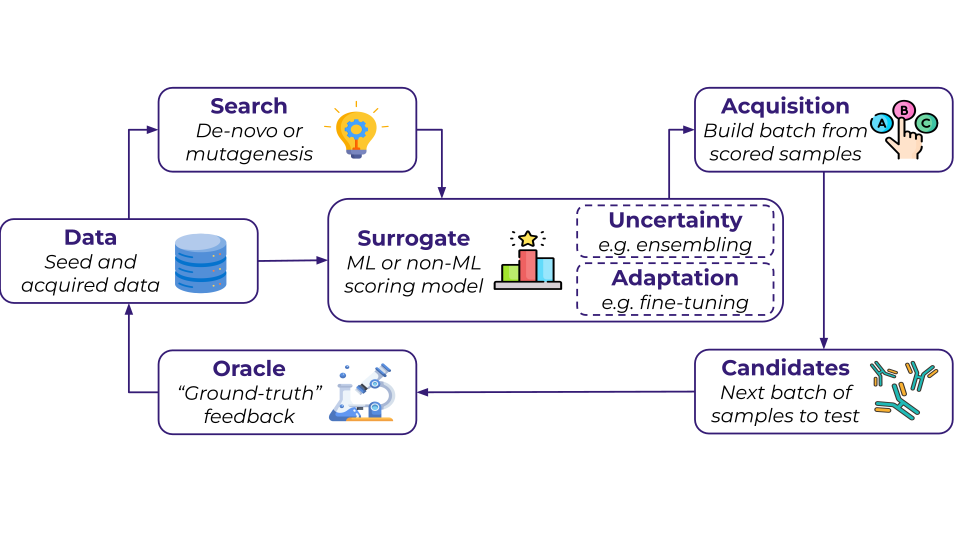

# ALF Core

This document provides an overview of the core components in the ALF (Active Learning Framework) library, describes the different task types, and explains how components interact during execution.

<div align="center">
  
</div>

## Overview

This README is organized into the following sections:

### Core Components
- **[1. Dataset (`BaseDataset`)](#1-dataset-basedataset)** - Data loading, splitting, and querying
- **[2. Model (`BaseModel`)](#2-model-basemodel)** - Abstract base class for all models
- **[3. Surrogate (`Surrogate`)](#3-surrogate-surrogate)** - Approximates expensive experimental evaluation
- **[4. Oracle (`Oracle`)](#4-oracle-oracle)** - Provides ground-truth labels for candidates
- **[5. Optimizer (`Optimizer`)](#5-optimizer-optimizer)** - Orchestrates the active learning loop
- **[6. Acquisition Function (`AcquisitionFunction`)](#6-acquisition-function-acquisitionfunction)** - Scores candidates for acquisition
- **[7. Search Strategy (`BaseSearch`)](#7-search-strategy-basesearch)** - Defines the candidate pool
- **[8. Task State (`TaskState`)](#8-task-state-taskstate)** - Tracks the state of active learning tasks

### Task Types
- **[1. Design Task (`DesignTask`)](#1-design-task-designtask)** - Multi-round active learning loop
- **[2. Supervised Task (`SupervisedTask`)](#2-supervised-task-supervisedtask)** - Train and evaluate on fixed data
- **[3. Zero-Shot Task (`ZeroShotTask`)](#3-zero-shot-task-zeroshottask)** - Evaluate pre-trained models

### Component Flow
- **[Design Task Flow](#design-task-flow)**
- **[Supervised Task Flow](#supervised-task-flow)**
- **[Zero-Shot Task Flow](#zero-shot-task-flow)**

## Core Components

### 1. Dataset (`BaseDataset`)

The `BaseDataset` class manages data loading, splitting, and querying. It handles:

- **Data Loading**: Loads raw labeled data through the abstract `load_dataset()` method
- **Data Splitting**: Splits data into train, validation, test, and candidate_pool sets
- **Split Updates**: Updates splits dynamically as new candidates are acquired during active learning
- **Querying**: Provides labels for candidates from the original dataset (used by the oracle in offline settings)

**Key Methods:**
- `load_dataset()`: Every child class needs to implement how to load the dataset and return it as `LabeledCamdidates`
- `_split_dataset()`: Splits the dataset based on the split config, which specifies the ratio of data points in train/val/test/candidate_pool sets and the splitting method (random or low_vs_high)
- `update_splits()`: Updates train/validation splits with newly acquired candidates
- `query()`: Returns labels for given candidates (for offline evaluation)

### 2. Model (`BaseModel`)

The `BaseModel` is an abstract base class that defines the interface for all models in the framework. Models can serve multiple roles depending on the context:

- **Surrogate Model**: Wrapped by `Surrogate` to approximate expensive experimental evaluations
- **Oracle Model**: Used directly by `Oracle` for online evaluation (simulating real experiments)
- **Generator Model**: Used by `GeneratorSearch` to sample candidate sequences from the model

**Key Abstract Methods:**
- `featurise()`: Converts inputs (candidates or labeled data) into features suitable for the model
- `train()`: Trains the model on labeled training and validation data
- `predict()`: Generates predictions (means and uncertainties) for candidate sequences
- `sample()`: Samples new candidate sequences from the model (used for generative search strategies)

**Optional Methods:**
- `get_training_summary_metrics()`: Returns training metrics (e.g., loss, accuracy) - defaults to empty dict
- `cleanup()`: Cleans up temporary files, checkpoints, or other resources - defaults to no-op

**Implementation Notes:**
- All concrete model implementations must inherit from `BaseModel` and implement all abstract methods, in case a particular method cannot be implemented (e.g., train for an oracle model) it should raise a NotImplementedError describing the reason
- The `predict()` method should return a `Predictions` object containing both mean predictions and uncertainty estimates
- The `sample()` method is particularly important for generative search strategies, where the model generates the candidate pool

### 3. Surrogate (`Surrogate`)

The surrogate approximates the expensive experimental evaluation. It wraps a `BaseModel` and provides:

- **Training**: Fits the model on labeled training data
- **Prediction**: Makes predictions on candidate sequences
- **Metrics**: Tracks training metrics and performance

**Key Methods:**
- `fit()`: Trains the surrogate on train/validation data
- `predict()`: Generates predictions (means and uncertainties) for candidates
- `get_training_summary_metrics()`: Returns training metrics

### 4. Oracle (`Oracle`)

The oracle provides ground-truth labels for candidates. It can be:

- **Offline**: Uses a `BaseDataset` to query labels from existing data
- **Online**: Uses a `BaseModel` to generate labels (simulating real experiments)

**Key Methods:**
- `evaluate()`: Evaluates candidates and returns labeled results

### 5. Optimizer (`Optimizer`)

The optimizer orchestrates the active learning loop through the ask-tell interface:

- **Ask**: Proposes the next batch of candidates to evaluate
- **Tell**: Updates the surrogate with newly acquired data

**Components:**
- **Acquisition Function**: Scores candidates based on surrogate predictions
- **Search Strategy**: Defines the pool of candidates to acquire from 

**Key Methods:**
- `ask()`: Returns the next acquired batch of candidates to evaluate
- `tell()`: Trains the surrogate on updated newly acquired data and returns metrics

### 6. Acquisition Function (`AcquisitionFunction`)

Acquisition functions determine which candidates are most promising to evaluate. They score candidates based on:

- Surrogate model predictions (means and uncertainties)
- Current task state (training data, round number, etc.)

**Common Acquisition Functions:**
- **Greedy**: Selects candidates with highest predicted values
- **UCB (Upper Confidence Bound)**: Balances exploitation and exploration
- **Expected Improvement**: Selects candidates with highest expected improvement
- **Thompson Sampling**: Uses Bayesian sampling for exploration

### 7. Search Strategy (`BaseSearch`)

Search strategies define the candidate pool available for acquisition. Types include:

- **DatasetSearch**: Uses the candidate pool from the dataset (offline experiments)
- **GeneratorSearch**: Samples candidates from a generative model
- **ProtocolSearch**: Uses a custom protocol to generate candidates
- **ModelProtocolSearch**: Combines a model with a protocol

**Key Methods:**
- `__call__()`: Returns the list of candidates to search over
- `get_metrics()`: Returns search-specific metrics (e.g., recall, regret)

### 8. Task State (`TaskState`)

The `TaskState` dataclass tracks the complete state of an active learning task:

- **Components**: Dataset, surrogate model, current round
- **History**: Records all acquired candidates per round
- **Metrics**: Tracks performance metrics for each round
- **Configuration**: Acquisition batch size, number of rounds, etc.

**Key Methods:**
- `update()`: Updates state with newly acquired candidates
- `evaluate()`: Evaluates surrogate on test set and updates metrics
- `save()`: Persists metrics and history to disk
- `should_terminate()`: Checks if optimization should stop

## Task Types

### 1. Design Task (`DesignTask`)

The design task implements a multi-round active learning loop for optimizing sequences:

**Workflow:**
1. **Initialization**: Setup dataset and surrogate
2. **For each round:**
   - **Ask**: Optimizer proposes candidates using search + acquisition
   - **Evaluate**: Oracle labels the candidates
   - **Update**: Add labeled candidates to training data
   - **Tell**: Retrain surrogate on updated data
   - **Evaluate**: Assess surrogate performance on test set
   - **Log**: Record metrics and save results

**Use Case**: Iteratively improve sequences by actively selecting and evaluating promising candidates.

**Components Required:**
- Dataset
- Surrogate model
- Optimizer (with acquisition function and search strategy)
- Oracle
- Logger

### 2. Supervised Task (`SupervisedTask`)

The supervised task trains a model on fixed training data and evaluates it:

**Workflow:**
1. **Setup**: Initialize dataset and surrogate
2. **Train**: Fit surrogate on train/validation splits
3. **Evaluate**: Assess performance on test set
4. **Save**: Save predictions and metrics

**Use Case**: Evaluate model performance on a fixed dataset split (no active learning).

**Components Required:**
- Dataset
- Surrogate model
- Logger

### 3. Zero-Shot Task (`ZeroShotTask`)

The zero-shot task evaluates a pre-trained or untrained model without training:

**Workflow:**
1. **Setup**: Initialize dataset and surrogate
2. **Evaluate**: Make predictions on test set (no training)
3. **Save**: Save predictions and metrics

**Use Case**: Evaluate pre-trained models or baseline performance without training.

**Components Required:**
- Dataset
- Surrogate model (pre-trained)
- Logger

## Component Flow

### Design Task Flow
1. **Setup Phase**:
   ```
   Task.setup(dataset, surrogate) → TaskState
   ```

2. **Round Loop** (for each acquisition round):
   ```
   a. Optimizer.ask(state) → candidates
      ├─ Search(state) → search_candidates
      ├─ Surrogate.predict(search_candidates) → predictions
      └─ Acquisition(predictions) → top_k candidates
   
   b. Oracle.evaluate(candidates, state) → labeled_candidates
   
   c. State.update(labeled_candidates)
      └─ Dataset.update_splits(labeled_candidates)
   
   d. Optimizer.tell(state, logger) → updated_state
      └─ Surrogate.fit(train_data, val_data)
   
   e. Task.evaluate(state) → updated_state
      ├─ Surrogate.predict(test_data) → predictions
      ├─ Results(predictions, targets) → metrics
      └─ State.save(metrics, history)
   ```

### Supervised Task Flow
1. **Setup Phase**:
   ```
   Task.setup(dataset, surrogate) → TaskState
   ```

2. **Training Phase**:
   ```
   Surrogate.fit(train_data, val_data, logger)
   ```

3. **Evaluation Phase**:
   ```
   Task.evaluate(state)
   ├─ Surrogate.predict(test_data) → predictions
   ├─ Results(predictions, targets) → metrics
   └─ State.save(metrics)
   ```

### Zero-Shot Task Flow
1. **Setup Phase**:
   ```
   Task.setup(dataset, surrogate) → TaskState
   ```

2. **Evaluation Phase** (no training):
   ```
   Task.evaluate(state)
   ├─ Surrogate.predict(test_data) → predictions
   ├─ Results(predictions, targets) → metrics
   └─ State.save(metrics)
   ```
