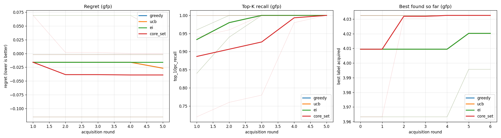

# ALF Benchmark Examples

Two small **benchmark scripts** showing the kind of comparison ALF is built
for: active-learning performance **as a function of acquisition round**. Each runs
several AL experiments, prints a summary table, and saves comparison plots.

This is a preview of the (separate, post-v1) `alf_benchmark` layer — not the full thing.

| Script | Compares | Fixed |
|--------|----------|-------|
| [`benchmarking_surrogates.py`](benchmarking_surrogates.py) | surrogate models: **CNN, GP, ESM-2** | greedy acquisition |
| [`benchmarking_acquisition_functions.py`](benchmarking_acquisition_functions.py) | acquisition functions: **greedy, UCB, EI, core_set** | a GP surrogate |

## Running

The scripts need plotting (matplotlib) and ESM-2 (transformers), bundled in the
`benchmark` dependency group — run them with `uv run --group benchmark`:

```bash
uv run --group benchmark python benchmark_examples/benchmarking_surrogates.py \
    --dataset gfp --num-rounds 5 --batch-size 50 --num-seeds 3

uv run --group benchmark python benchmark_examples/benchmarking_acquisition_functions.py \
    --dataset gfp --num-rounds 5 --batch-size 50 --num-seeds 3
```

Each writes a comparison PNG and `summary.csv` under `--output-dir`
(default `benchmark_examples/outputs/<script>/`).

## Flags

| Flag | Default | Notes |
|------|---------|-------|
| `--dataset {gfp,flip,proteingym}` | `gfp` | All download on first use, no token. |
| `--num-rounds` / `--batch-size` | `5` / `50` | Keep their product below the candidate-pool size. |
| `--num-seeds` | `3` | Replications; results are averaged and per-seed lines drawn. |
| `--epochs` | `20` | CNN epochs / GP iterations / ESM linear-head epochs. |
| `--esm-model-id` | `facebook/esm2_t6_8M_UR50D` | *(surrogates only)* Any ESM-2 checkpoint. |
| `--output-dir` | `benchmark_examples/outputs/<script>/` | Created if missing. |

## What the plots show

- **Surrogates** — *test Spearman vs round* (predictive quality) and *best-found-so-far
  vs round*. Each surrogate is a coloured curve: bold mean over seeds + faint per-seed
  lines (so run-to-run variance is visible).
- **Acquisition functions** — headline **split-relative** metrics *regret vs round* and
  *top-K recall vs round*, plus *best-found-so-far*. `core_set` is a pure-diversity
  (exploration) baseline that ignores the surrogate's predictions, so it is expected to
  trail on best-found — it is included as a contrast, not a contender.

## Example output

Illustrative result from the acquisition-function benchmark (your numbers will vary with
dataset, seeds, and hardware):

```bash
uv run --group benchmark python benchmark_examples/benchmarking_acquisition_functions.py \
    --dataset gfp --num-seeds 3 --num-rounds 5 --batch-size 50
```



Bold lines are the mean over seeds; faint lines are individual seeds. The printed summary
(also written to `summary.csv`) reports final-round values, mean ± std over seeds:

| acquisition | regret | best found | top-K recall |
|-------------|--------|------------|--------------|
| greedy      | -0.027 ± 0.064 | 4.020 ± 0.017 | 1.00 ± 0.00 |
| ucb         | -0.027 ± 0.064 | 4.020 ± 0.017 | 1.00 ± 0.00 |
| ei          | -0.016 ± 0.076 | 4.020 ± 0.017 | 1.00 ± 0.00 |
| core_set    | -0.039 ± 0.054 | 4.033 ± 0.000 | 1.00 ± 0.00 |

On GFP these acquisition functions perform similarly — a fair, if undramatic, result; the
gaps widen on harder landscapes.

## How it works

Each experiment is a `DesignTask` run with a `FileStateLogger`; `_bench.py` reads the
per-round `metrics.csv`, adds an explicit round index, derives best-found-so-far, and
aggregates across seeds. For a fair comparison, **every config in a given seed rebuilds
its own dataset with that same seed** (identical split), and all RNGs are seeded before
the model is built.
