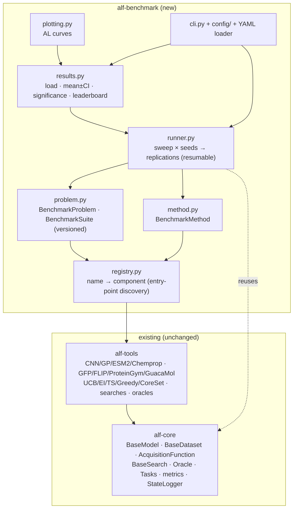
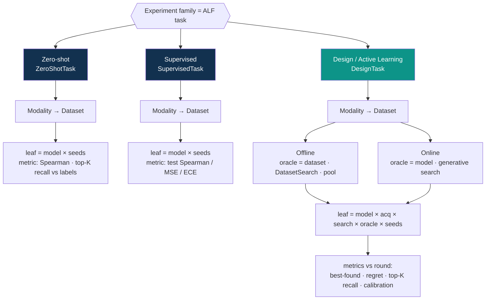

# Feature Plan: ALF Benchmarking Layer (`alf-benchmark`)

**Created**: 2026-06-08
**Status**: Approved (pending final review)

## Summary

Add a third package, **`alf-benchmark`**, that sits above `alf-core` and `alf-tools` and turns ALF
from "a framework that runs one active-learning experiment" into "a benchmark suite the research
community can run, extend, and cite."

It provides: a **registry** (add a tool, reference it by name), **`BenchmarkProblem` / `BenchmarkMethod`**
(frozen, versioned definitions that make results comparable), a **`BenchmarkRunner`** (sweeps
`{dataset × model × acq_fn × search_fn × oracle × seed}`, reusing the existing tasks unchanged),
**aggregation + statistics + plots** (the figures reviewers want), a **YAML + CLI** wrapper, and a
**versioned suite with reference results + leaderboard** for a NeurIPS Datasets & Benchmarks submission.

### Connection to the mission

ALF's mission is to *maximise information gained per round of expensive experimentation*. The headline
benchmark axis is therefore **sequential / active-learning performance** — best-found-so-far, simple &
cumulative regret, top-K pool recall, and calibration **as a function of acquisition round** — not just
one-shot fitness prediction. This is the gap ProteinGym (zero-shot/supervised) and FLIP (supervised)
leave open, and it is ALF's distinct, citable contribution. Every component below exists to make that
axis easy to measure, reproduce, and beat.

## Decisions Made

| Decision | Selected | Rationale |
|----------|----------|-----------|
| Delivery | Phased: usability core → NeurIPS artifacts | Ship a credible minimum early; layer citable artifacts on top |
| Config | Both: pydantic-as-code (core) + YAML/CLI (wrapper) | Type-checked core API for Python users; declarative configs for the wider community |
| Placement | New package `benchmark/alf_benchmark`, depends on `alf-tools` | Keeps plotting/parquet/CLI/stats deps out of core & tools; mirrors existing 2-package split |
| Registry | Python **entry-points** for discovery | External packages register components **without importing `alf-benchmark`** — the key adoption lever |
| Differentiator | AL curves (regret/best-found/recall/calibration vs round) | Distinguishes ALF from ProteinGym/FLIP; aligns with the mission |
| Registry build | Each entry stores `(class, config_cls[...])`; builder coerces the dict | Components have heterogeneous ctors (1 pydantic config / 2 dataclasses / scalar kwargs); keeps core & tools classes untouched (entry-points only) |
| Oracle wiring | `offline` binds Oracle to the problem's dataset instance; `online` builds a model oracle from the method spec | `Oracle(scorer=dataset)` shares the dataset; datasets load+split (+download) in `__init__`, so one load per replication |
| Seeding | Runner sets a global seed (numpy+torch+cuda) per replication and threads it into the dataset config; optional `deterministic` flag | Dataset seed only controls the split; training RNG must be controlled for reproducible CIs (D&B grading) |
| AL curves | Derived in `results.py` (running max / cumulative); guard missing metrics; suite constrains to `DatasetSearch` | Best-found-so-far isn't logged; calibration needs a UQ model; regret/recall only from `DatasetSearch` — keeps core unchanged |

## Architecture



**One replication = one existing `task.run()`.** The runner is pure orchestration: it instantiates
components from configs via the registry, calls the unchanged `DesignTask`/`SupervisedTask`/`ZeroShotTask`,
points a `FileStateLogger` at a per-replication directory, and records a manifest. No changes to
`alf-core` or `alf-tools` are required for Phases 1–3.

### Conceptual model

```
BenchmarkSuite (versioned, e.g. "alf-protein-v1")
└── BenchmarkProblem            # WHAT we optimise — frozen
    ├── dataset config + split + problem_type
    ├── seeds = [0, 1, 2, 3, 4]
    └── primary_metric (defines "success")
        × BenchmarkMethod        # HOW we optimise — frozen
          ├── surrogate model (name + config)
          ├── acq_fn / search_fn / oracle (name + config)
          └── task config (num_acq_rounds, acq_batch_size)
            → Runner expands (problem × method × seed) into replications
              → each replication = task.run() → metrics.csv + manifest.json
                → Results aggregates replications → mean ± CI → leaderboard + plots
```

## Experiment Taxonomy — what a user can run

The sweep grid is **not a flat Cartesian product**. It is a tree whose depth depends on the experiment
family (the ALF task). The full `model × acq × search × oracle` combination is a **`DesignTask` leaf**;
zero-shot and supervised families have no acquisition rounds, so they collapse to `model × seeds`.



**Modality → Dataset** (same for every family; the dataset implies the modality):
- **Protein** (sequence): `GFP` · `FLIP{AAV,GB1,Meltome,SCL,SAV}` · `ProteinGym{DMS assays}`
- **Molecule** (SMILES): `GuacaMol{MolLogP, QED, …}`

### Three rules that make the space concrete (and sparse)

1. **The 4-way combination is a design-task leaf only.** Zero-shot scores a pretrained model once
   (e.g. `ESM2Model(scoring_function=None)`); supervised trains once on a fixed split. Neither has an
   acquisition fn, search fn, or oracle *choice* — their leaf is `{model × seeds}` and the metric is a
   ranking/accuracy/calibration score against the dataset's held-out labels.
2. **Offline vs. online is a design-only property of the oracle, and it couples search + oracle:**
   - **Offline** ⇒ `Oracle(scorer=dataset)` + `DatasetSearch` (pool-based; candidates must exist in the dataset).
   - **Online** ⇒ `Oracle(scorer=model)` (e.g. `ESMFoldModel`, `PyRosetta`) + a generative search
     (`SingleMutantSearch` / generator; candidates are synthesised).
3. **The leaf is a sparse matrix — compatibility constraints prune it:**
   - `model ↔ modality`: ESM-2 & CNN(AA) → protein; Chemprop → molecule; GP/CNN work on either once featurised.
   - `acq ↔ uncertainty`: UCB / EI / Thompson need an uncertainty model (GP, `EnsembleWrapper`); Greedy / CoreSet do not.
   - `search / oracle ↔ mode`: as in rule 2.

The registry + `MethodConfig` validation enforce these at build time, so an invalid cell fails fast with a
clear error instead of producing a misleading result.

### Concrete runs this defines

| Family | Dataset | Mode | model | acq | search | oracle | headline metric |
|---|---|---|---|---|---|---|---|
| Zero-shot | ProteinGym · BLAT_ECOLX | — | ESM-2 (no head) | — | — | labels | Spearman |
| Supervised | FLIP · GB1 | — | GP / CNN / ESM-2 | — | — | labels | test Spearman, ECE |
| Design | GFP | offline | CNN / GP / ESM-2 | UCB / EI / Greedy / CoreSet | DatasetSearch | dataset | best-found @ round 6 |
| Design | seed protein | online | GP | UCB | SingleMutantSearch | ESMFold (pTM) | best-found @ round R |
| Design | GuacaMol · QED | offline | Chemprop | UCB / Greedy | DatasetSearch | dataset | best-found @ round 6 |

This taxonomy is the user-facing contract the YAML/CLI (Phase 3) and the interactive Experiment Explorer
expose: choose a family → modality → dataset → (mode) → fill the leaf, and only compatible components are offered.

---

## Result Schema (the contract everything depends on)

Each replication writes to `runs/<problem>/<method>/seed=<n>/`:

- `metrics.csv` — already produced by `FileStateLogger`; one row per round, flat keys
  (`surrogate/test_spearman`, `dataset/num_train`, …). The runner appends `round`, `problem_id`,
  `method_id`, `seed`.
- `manifest.json` — **reproducibility record**: resolved configs, git SHA, package versions,
  dataset hash, hardware, wall-clock, ALF/suite version, status (`completed`/`failed`).
- `acq_round_*.csv`, `*_predictions.csv` — already produced by `FileStateLogger`.

Aggregation reads `metrics.csv` + `manifest.json` across seeds → tidy long-form DataFrame
`(problem, method, seed, round, metric, value)`, the single input to stats, leaderboard, and plots.
A stable schema is what lets reference results stay comparable across ALF versions (the ProteinGym lesson).

**Already emitted per round** (verified in code, so no core changes needed): `surrogate/test_*`,
`dataset/*`, `ask_time`/`tell_time`, and — for `DatasetSearch` — `optimizer/regret`,
`optimizer/top_*_recall`. **Metric columns are ragged** across problem types and UQ-vs-not (calibration
metrics only appear when the model emits variances); the loader outer-joins on the union of columns and
the manifest records `problem_type` so partial coverage is explicit rather than a silent NaN.

---

## Phase 1 — Usability core *(the credible minimum)*

**Goal:** sweep a grid × seeds from Python and get structured, reproducible results, reusing existing tasks.

**Why first:** this is the smallest thing that delivers real value (no more hand-wired notebooks) and
de-risks every later phase, which all consume its outputs.

**Create:**
- `benchmark/pyproject.toml` — package `alf_benchmark`, depends on `alf_tools`; deps: `pydantic`,
  `pyarrow`/`pandas`. Register entry-point **groups** (`alf.models`, `alf.datasets`, `alf.acquisition_functions`,
  `alf.searches`, `alf.oracles`).
- `benchmark/alf_benchmark/registry.py` — `Registry` keyed by `(group, name)`; each entry stores a
  **`RegistryEntry(component_cls, config_cls | tuple[config_cls, ...])`** so the builder knows how to
  coerce a config dict (datasets → one pydantic config / its subclass; models → `(ModelConfig, TrainConfig)`
  dataclasses; acq fns → scalar kwargs). `discover()` loads entry points; `build(group, name, cfg_dict)`
  returns the constructed object; `@register(group, name, config_cls=...)` is local sugar. **Dataset-derived
  params (`seq_length`, `output_neurons`) are NOT in the config — the existing `surrogate.setup(dataset)`
  supplies them**, so models register with their two config classes only.
- `benchmark/alf_benchmark/config/` — pydantic configs: `ComponentSpec(name, config: dict)`,
  `ProblemConfig`, `MethodConfig` (with `oracle.mode: "offline" | "online"`), `RunConfig`.
  These are the **core API** (config-as-code).
- `benchmark/alf_benchmark/seeding.py` — `seed_everything(seed, deterministic=False)` seeds
  numpy/torch/cuda; the runner calls it per replication and injects the same seed into the dataset config.
- `benchmark/alf_benchmark/problem.py` — `BenchmarkProblem` (builds a configured `BaseDataset`,
  holds seeds + `primary_metric` + `version`) and `BenchmarkSuite` (named, versioned list of problems).
- `benchmark/alf_benchmark/method.py` — `BenchmarkMethod` (resolves surrogate/acq/search/oracle/task
  from the registry).
- `benchmark/alf_benchmark/schema.py` — manifest dataclass + writer; metrics-CSV augmentation helpers.
- `benchmark/alf_benchmark/runner.py` — `BenchmarkRunner.run(suite, methods, output_dir)`: for each
  `(problem, method, seed)` it calls `seed_everything`, builds the dataset once, **binds the oracle by mode**
  (`offline` → `Oracle(scorer=problem.dataset)` reusing that instance; `online` → model oracle from the
  method spec), builds surrogate/optimizer, runs the matching task with a `FileStateLogger` pointed at the
  replication dir, and writes the manifest. **Skips completed cells** (resumable via manifest), wraps each
  replication in try/except so one failure never aborts the sweep, records status. Sequential now;
  `n_jobs` hook left as a TODO.

**Modify (minimal, additive):**
- `tools/pyproject.toml` — declare entry points mapping names (`cnn`, `gp`, `ucb`, `gfp`, …) to existing
  `alf_tools` classes. This is the only `alf-tools` touch and it's pure metadata.
- Root `pyproject.toml` / `uv.sources` — add `alf_benchmark = { path = "benchmark", editable = true }`.

**Verify:** run a tiny 2-method × 1-dataset × 2-seed sweep on GFP with a CNN surrogate; confirm
per-replication `metrics.csv` + `manifest.json` exist and a resumed run skips completed cells.

---

## Phase 2 — Aggregation, statistics & plots *(the figures reviewers want)*

**Goal:** turn raw replications into defensible comparisons.

**Why:** a benchmark number without seed variance and significance is not credible; AL curves are the
mission-aligned headline figure.

**Create:**
- `benchmark/alf_benchmark/results.py` — `BenchmarkResults.from_dir()`; `aggregate()` →
  mean ± **bootstrap CI** per `(problem, method, round, metric)`; `significance()` → paired tests across
  methods on the primary metric; `leaderboard()` → ranked table (final-round primary metric, mean ± CI).
- `benchmark/alf_benchmark/plotting.py` (deps: `matplotlib`) — `plot_curves()` for **best-found-vs-round,
  simple/cumulative regret-vs-round, top-K recall-vs-round, calibration (ECE)-vs-round**, with CI bands;
  `plot_leaderboard()`.

**Derivation, not new columns:** `best-found-so-far` and `cumulative regret` are computed in `results.py`
as a running max / running sum over the per-round `optimizer/*` values (they are not logged directly).
Curves guard missing metrics: calibration is plotted only for UQ models, regret/recall only when a
`DatasetSearch`-based method produced them. The suite docs state "full AL curves require `DatasetSearch`
+ a UQ-capable model for calibration." No `alf-core` changes.

**Verify:** from Phase-1 outputs, produce a leaderboard table + a regret-vs-round figure with CI bands
for two methods; sanity-check CIs shrink with more seeds.

---

## Phase 3 — YAML + CLI *(declarative, for the wider community)*

**Goal:** run/aggregate/plot a full experiment without writing Python.

**Why:** lowers the barrier for non-Python users and makes experiments diffable & PR-reviewable.

**Create:**
- `benchmark/alf_benchmark/yaml_loader.py` — parse YAML into the Phase-1 pydantic configs (validation
  is free — reuse the pydantic models; YAML is a thin front door, not a parallel config system).
- `benchmark/alf_benchmark/cli.py` + `[project.scripts] alf-bench` — subcommands
  `run <config.yaml>`, `aggregate <dir>`, `plot <dir>`, `list` (show registered components / suites).

**Verify:** `alf-bench run` reproduces the Phase-1 sweep from a YAML file; `alf-bench list` shows all
entry-point-discovered components including a dummy externally-registered one.

---

## Phase 4 — NeurIPS artifacts *(what makes it citable & adopted)*

**Goal:** a versioned suite, reference baselines, leaderboard, and one-command reproduction.

**Why:** fixed assays + pinned splits + reference scores are what make a benchmark reusable and citable
(the ProteinGym/FLIP playbook); reproducibility is graded directly in the D&B track.

**Create:**
- `benchmark/alf_benchmark/suites/alf_protein_v1.yaml` — pinned splits/seeds over existing
  FLIP/ProteinGym/GFP datasets; `version` field frozen.
- `benchmark/reference_results/` — committed baseline runs + generated `LEADERBOARD.md`. **Keep committed
  baselines CPU-friendly** (e.g. CNN/GP on GFP/FLIP) so a fresh clone reproduces them without a GPU;
  heavier ESM2/Chemprop runs (GPU + `HF_TOKEN` + downloads) are documented as a separate, optional tier
  rather than claimed as one-command reproducible.
- `benchmark/dataset_cards/` — provenance, license, split definition, known-leakage notes per dataset.
- `tutorials/benchmark/benchmark_tutorial.ipynb` — "run a suite" + "register my model and beat the baseline".
- `benchmark/README.md` + reproduction script (`alf-bench run suites/alf_protein_v1.yaml`).

**Verify:** fresh clone reproduces a headline leaderboard row within CI; tutorial runs end-to-end.

---

## Testing Strategy

- **Unit:** registry (register/discover/**build** for all 3 config shapes, missing-name error), config
  validation, manifest round-trip, aggregation math (known-input mean/CI, derived best-found/cumulative
  regret), ragged-column loader, `seed_everything` reproducibility (two runs at the same seed match),
  resumability (skip completed).
- **Integration:** full tiny sweep (2 methods × 1 dataset × 2 seeds, CNN, 2 rounds) → assert files,
  schema, leaderboard shape. Fast + deterministic (fixed seeds, no network — use a synthetic/local dataset).
- **Plugin test:** a dummy package registering a fake model via entry points is discovered without importing `alf-benchmark`.
- Follows existing conventions: `tests/test_<module>.py`, ruff + mypy clean.

## Risks & Tradeoffs

- **Registry indirection** — one layer between config and class. Mitigated by keeping `ComponentSpec`
  trivial and offering the decorator as sugar.
- **Schema lock-in** — reference results depend on the schema. Mitigated by versioning the manifest and suite.
- **Compute for reference runs** — keep `alf-protein-v1` deliberately small for committed baselines; document
  how to scale up.
- **Scope vs. deadline** — Phases 1–2 are the credible minimum; 3–4 can follow without rework since they only
  consume Phase-1/2 outputs.

## Rollback

Self-contained new package. Rollback = remove `benchmark/`, revert the two additive entry-point blocks in
`tools/pyproject.toml` and root `pyproject.toml`. `alf-core` and `alf-tools` behaviour is untouched.

## Files at a glance

**Create:** `benchmark/pyproject.toml`, `benchmark/alf_benchmark/{registry,problem,method,runner,results,schema,plotting,cli,yaml_loader,seeding}.py`,
`benchmark/alf_benchmark/config/`, `benchmark/alf_benchmark/suites/`, `benchmark/reference_results/`,
`benchmark/dataset_cards/`, `benchmark/README.md`, `tutorials/benchmark/benchmark_tutorial.ipynb`, tests.

**Modify:** `tools/pyproject.toml` (entry points), root `pyproject.toml` (uv source) — both additive.
