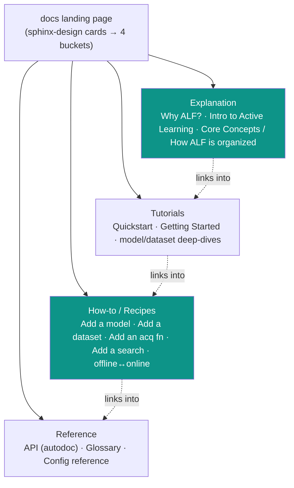

# Feature Plan: ALF Documentation Improvement (open-source readiness)

**Created**: 2026-06-09
**Status**: Approved — revised after challenge-plan review (premises verified against codebase).
Publishing + OSS-hygiene work is **deferred** to a pre-launch checklist (we are not open-sourcing yet and
do not want the docs public now); active scope is the two content phases below.

## Summary

Raise ALF's documentation toward open-source-launch quality by closing the gaps between what we
have and what a best-in-class library (Meta's **Ax**, the adaptive-experimentation platform) ships.
ALF is already strong on **tutorials** (~20 notebooks) and **API reference** (Sphinx + Napoleon,
Google-style docstrings, type hints). The gap is **explanation** (the conceptual on-ramp) and **findability**
(content isn't bucketed by reader intent).

The fix is mostly **new narrative pages**, *not* a tooling change. We **keep Sphinx** and add MyST (Markdown)
+ `sphinx-design` for Ax-style landing/card pages. All work here is **internal** — it improves the docs the
team builds locally / in CI without making anything public. The publishing step and OSS-hygiene files
(`LICENSE`/`CHANGELOG`/`CODE_OF_CONDUCT`) are captured in a **pre-open-source-launch checklist** at the end,
to be actioned only when we decide to go public.

### Connection to the mission

The benchmarking initiative's priority 1 is **research-community usability and adoption**. Adoption is
gated by the first 10 minutes a newcomer spends in the docs: can they understand *why* ALF exists, build a
*mental model* of its objects, run something, and then find *how to add their own tool*? Ax converts that
on-ramp better than we do today. Every item below exists to shorten "land → understand → run → extend → cite".

## Decisions Made

| Decision | Selected | Rationale |
|----------|----------|-----------|
| Toolchain | **Keep Sphinx** (+ MyST + `sphinx-design`) | Existing autodoc/Napoleon/type-hint setup is solid; migration to Docusaurus is cost without payoff |
| Organising model | **Diátaxis** (Tutorials · How-to · Reference · Explanation) | Same model Ax uses; separates the four distinct reader needs instead of one undifferentiated pile |
| Authoring format | **MyST Markdown** for narrative; RST kept for autodoc | Lower contribution barrier (community writes Markdown); no rewrite of existing autosummary RST |
| Hosting | **GitHub Pages via CI** *(already wired; deferred until launch)* | The CI exists and deploys today; publicising is gated by repo visibility, not by this plan. Held in the pre-launch checklist until we open-source |
| Open-sourcing now? | **No — defer publishing + OSS files** | We are not going public yet; docs should stay internal. Concept + reorg work is useful internally regardless and proceeds now |
| Sequencing | Phase 1 (concepts) → Phase 2 (reorg/polish) → pre-launch checklist | Concepts are the real differentiator and help the team immediately; reorg reuses existing content; legal/publishing prep waits for the go-public decision |
| Differentiator framing | Lead with **sequential active-learning** value prop | The same gap-vs-ProteinGym/FLIP story that anchors the benchmark; consistent narrative across repo + paper |

## Current state vs. Ax (the gap)

```
Diátaxis quadrant      Ax                              ALF today
─────────────────────  ──────────────────────────────  ──────────────────────────────
Explanation (why/      "Why Ax?", "Intro to Adaptive    ❌ none (README feature list only)
  understand)            Experimentation", "Internal      no "Why ALF?", no "Intro to AL",
                         Organization of Ax"              no "How ALF is organized"
Tutorials (learning)   Quickstart → Getting Started      ✅ ~20 notebooks (strong)
                         → deep dives
How-to (task)          Recipes                           ⚠️ extension notebooks exist but
                                                            not framed/landed as how-tos
Reference (lookup)     API ref (hosted) + Glossary       ✅ Sphinx API ref (already PUBLISHED
                                                            via GitHub Pages CI)
                                                          ❌ no glossary
OSS hygiene            LICENSE/COC/CHANGELOG/SECURITY     ❌ missing — DEFERRED to pre-launch
                                                            checklist (not open-sourcing yet;
                                                            license already decided: Apache-2.0)
```

### Target information architecture


(Teal = the genuinely new buckets: **Explanation** and a framed **How-to** section. Tutorials/Reference exist and get reorganised, not rewritten.)

---

## Phase 1 — The conceptual on-ramp *(the real Ax gap)*

**Goal:** a newcomer can understand *why ALF* and build a *mental model* before touching the API.

**Why:** this is exactly what Ax does and we don't. It is the highest-leverage adoption lever.

**Create (MyST Markdown under `docs/source/explanation/`):**
- `why-alf.md` — value prop; lead with the **sequential active-learning** differentiator (regret/best-found/
  recall/calibration vs round; the gap ProteinGym/FLIP leave open). Mirrors the deck's "why".
- `intro-to-active-learning.md` — the *method*: the ask/tell loop, offline vs online, why information-per-round
  matters. Pure concept, no API. ALF's analog of Ax's "Intro to Adaptive Experimentation".
- `core-concepts.md` — the mental model of ALF's objects and how a round flows:
  `Dataset · Model · Surrogate · AcquisitionFunction · Search · Oracle · Task`. ALF's analog of Ax's
  "Internal Organization of Ax". **Reuse the experiment-taxonomy diagram** (already in
  `plans/benchmarking-layer.md`) and link the interactive `experiment_explorer.html`.

**Create reference:**
- `docs/source/reference/glossary.md` — surrogate vs oracle, acquisition vs search, offline/online,
  zero-shot/supervised/design, regret/recall/calibration/ECE. Use Sphinx `glossary` directive so terms
  become cross-referenceable (`:term:`) from every other page.

**Verify:** each page builds; the quickstart's terms resolve to glossary entries; a reader with no prior
context can answer "what is a surrogate vs an oracle?" from `core-concepts` + glossary alone (smoke-read).

---

## Phase 2 — Reorganise tutorials, add Recipes, landing page *(findability & polish)*

**Goal:** content is bucketed by reader intent; "how do I add X?" is one click away.

**Why:** the material largely exists (20 notebooks); it just isn't *findable* or *framed*. Low effort, high payoff.

**Prereq (small, internal):** add `sphinx-design` to the docs dependency group in `pyproject.toml` and to
`extensions` in `conf.py` — needed for the card grid below. (`myst-parser` is already configured; no other
tooling change.)

**Create:**
- `docs/source/index.md` (landing) — `sphinx-design` grid of four cards (Tutorials · How-to · Explanation ·
  Reference) + a 15-line runnable Quickstart, Ax-style. Replaces the flat `index.rst` TOC as the front door
  (the autosummary RST stays, linked under Reference).
- `docs/source/how-to/` index + recipe pages framing the existing extension notebooks as task-oriented
  how-tos: **Add your own model**, **Add a dataset**, **Add an acquisition function**, **Add a search**,
  **Switch offline ↔ online**. These wrap/point at `tutorials/extending_base_classes/*` rather than duplicating.
- `docs/source/tutorials/index.md` — a learning path: Quickstart → Getting Started → model/dataset deep dives.
  Notebooks stay as **external GitHub links** (as they are today in `index.rst`); this page curates and orders
  those links by learning path. No in-site notebook rendering — keeps the build fast and dependency-light, and
  GitHub already renders `.ipynb` with committed outputs.

**Modify:**
- `docs/source/index.rst` → fold its TOC into the new `index.md` + per-bucket `toctree`s.
- Cross-link: every explanation page ends with "→ now try the tutorial"; every how-to links the relevant API ref.

**Verify:** the four buckets each have a landing page and appear in the sidebar; the notebook links resolve;
no orphaned pages (Sphinx `--keep-going` reports no orphan warnings).

---

## Testing / Verification Strategy

- **Build gate:** `sphinx-build --keep-going` in CI; surface (report) all warnings including broken cross-refs
  and orphans, but do **not** fail the build on warnings (`-W`) — the existing autodoc setup emits benign
  warnings, and a hard fail would block unrelated PRs. Treat the warning list as a review checklist.
- **Link check:** `sphinx-build -b linkcheck` for external links (incl. the GitHub notebook links).
- **Cold-read smoke test:** a teammate unfamiliar with ALF follows landing → quickstart end-to-end; capture
  friction points as issues.
- **Content QA:** grep the built site for leftover TODO/placeholder text before declaring done.

## Risks & Tradeoffs

- **Accidental publishing** — the docs CI already deploys to GitHub Pages on push to `main`. While the repo
  stays private the site is not public, but anyone flipping repo visibility would expose it. Mitigation: this
  is a repo-settings concern, tracked in the pre-launch checklist; nothing in the active phases changes it.
- **MyST + RST coexistence** — mixing formats can confuse contributors. Mitigated by a one-paragraph
  "authoring guide" in CONTRIBUTING: *narrative = MyST Markdown, API = autodoc RST*.
- **Scope creep** — Phases are independent and value-ordered; Phase 1 alone is a meaningful internal improvement.

## Rollback

Additive and self-contained. Rollback = remove the new pages under `docs/source/{explanation,how-to,reference}/`,
revert the `sphinx_design` extension addition and restore `index.rst`. No code, API, or CI changes.

## Files at a glance *(active scope — internal only)*

**Create:** `docs/source/index.md`,
`docs/source/explanation/{why-alf,intro-to-active-learning,core-concepts}.md`,
`docs/source/how-to/` (index + recipes), `docs/source/tutorials/index.md`, `docs/source/reference/glossary.md`.

**Modify:** `pyproject.toml` docs group (add `sphinx-design` only), `docs/source/conf.py` (add `sphinx_design`
to extensions), `docs/source/index.rst` (fold into landing), `docs/CONTRIBUTING.md` (authoring-format note).

**Verify (already exist, do not create):** `myst_parser` in `conf.py`, `myst-parser`/`sphinx`/`furo` in the
docs dependency group.

---

## Pre-open-source-launch checklist *(DEFERRED — action only when we decide to go public)*

Not part of the active scope. Captured here so it isn't lost; revisit when open-sourcing is approved.

- **`LICENSE`** — add the standard **Apache-2.0** license text (already the decided license; every source file
  carries the header). Clerical, no decision needed.
- **`CODE_OF_CONDUCT.md`** (Contributor Covenant), **`CHANGELOG.md`** (Keep a Changelog, seed `Unreleased`),
  optional **`SECURITY.md`**.
- **Publishing** — the GitHub Pages CI (`.github/workflows/docs.yaml`) already builds + deploys; going public
  is gated by **repo visibility**, not by this plan. Confirm the published URL renders before launch.
- **Root `README.md`** — add a "Documentation" badge/link pointing at the published site (only meaningful once
  public).
